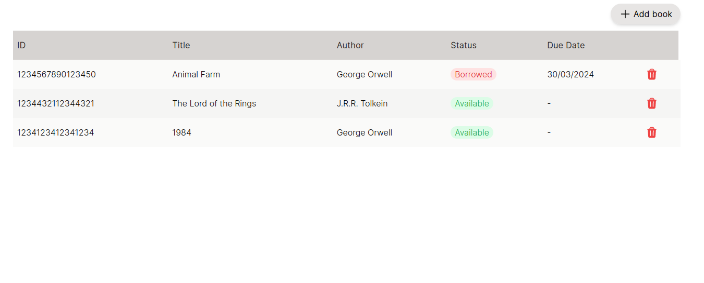

# Bookbyte-webapp

This project is a Next.js web application focused on delivering exceptional performance and user experience. It's built
using React and Next.js, and managed with npm.

## Getting Started

To get the web app running locally, ensure you have [Node.js](https://nodejs.org/) and [npm](https://nodejs.org/en)
installed on your system.

Configure the `API_URL` environment variable in the .env.local file with the correct backend URL. The default will be `http://localhost:8080`.

### Prerequisites

- Node.js >= 16.20.2
- Npm >= 8.19.4
- Bookbinder - Backend Server running on port 8080

### Installation

1. Navigate to the project folder:
   `cd bookbyte-webapp`
2. Install dependencies: `npm install`
3. To start the development server run `npm run dev`.

### Linting

- To check linting run: `npm run lint`
- To fix and check style with prettier run: `npm run prettier`

### Testing

Bookbyte-Webapp uses Cypress for end-to-end testing.
Make sure both the backend and the webapp is running. Then run the following:

- To run cypress tests run: `npx cypress open`
- Click "End-to-End Tests"
- Run the appropriate test specs

## Preview:

