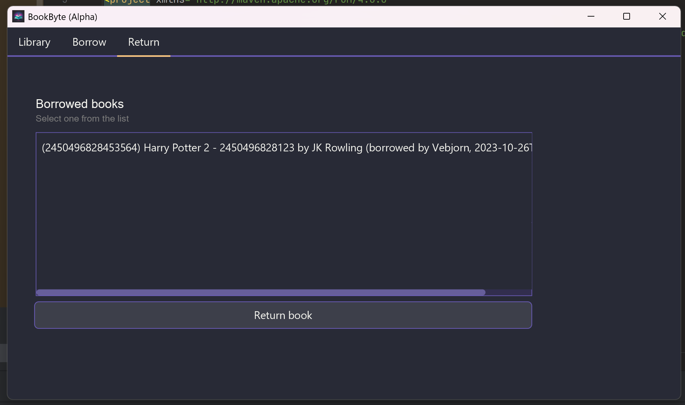

# BookByte
## Introduction
BookByte is an app for librarians to organizing their books. It is implemented as a JavaFX-app with added functionality for logic.
The librarian should be able to add and remove books, and set rent status per book.

A library contains a set of "library books", which are only valid if the books are in the book catalogue. Here is how the app looks:

*Figure 1: Startpage of Bookbyte app. This page facilitates adding and removing books from the library, while also featuring a page-swapping at the top.*

*Figure 2: Borrow page of Bookbyte app. This page displays available books in a list format, allowing users to borrow a book by selecting it and providing their name and email.*

*Figure 3: Return page of Bookbyte app. This page exhibits borrowed books in a list format, enabling users to return a book by selecting it.*

## User stories

User stories can be found in the [userstories.md](userstories.md) file.

## Modularization
The project is structured into modules. There are further READMEs that explain what each file does in their own folder.

- [core](../core/src/main/java/bookbyte/core/README.md) - contains the logic of the app.

- [ui](../ui/src/main/java/bookbyte/ui/README.md) - app based on JavaFX and FXML.

- [webapp](../../bookbyte-webapp/README.md) - webapp based on react and next.js 

- [REST](../bookbinder/docs/getting_started.md) - Spring-boot REST-server for the library 

## Storage Method
In the development of the library program, the storage method implemented uses a document metaphor for data management. This approach is intentionally designed to prevent accidental saving of data, which in turn helps to significantly reduce the likelihood of storing incorrect information. This method ensures a more reliable and error-resistant system for data handling within the library program.

## Diagrams

*Figure 4: Package diagram illustrating the architecture of Bookbyte*

*Figure 5: Class diagram illustrating the core-module of Bookbyte*

*Figure 6: Sequence diagram depicting the process of a librarian adding a book to the library.*